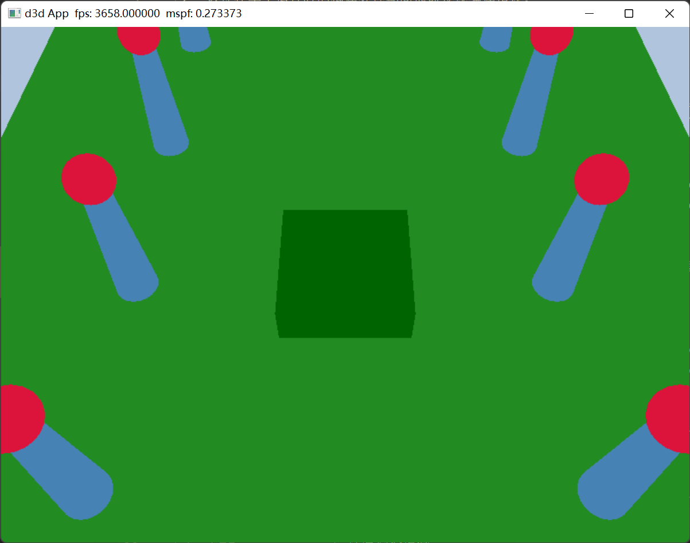

# 利用 Direct3D 绘制几何体（续）

[生成几何体](生成几何体.md)




鼠标左键控制镜头上下左右（球坐标系），鼠标右键控制距离远近。

数字 1 键切换线框模式。


## 帧资源

我们在每帧绘制的结尾都会调用 `D3DApp::FlushCommandQueue` 函数，以确保 GPU 在每一帧都能正确完成所有命令的执行。这种解决方案虽然奏效却效率低下，原因如下：

1. 在每帧的起始阶段，GPU 不会执行任何命令，因为等待它处理的命令队列空空如也。这种情况将持续到 CPU 构建并提交一些供 GPU 执行的命令为止。
2. 在每帧的收尾阶段，CPU 会等待 GPU 完成命令的处理。

所以，CPU 和 GPU 在每一帧都存在各自的空闲时间。

解决此问题的一种方案是：以 CPU 每帧都需更新的资源作为基本元素，创建一个环形数组（circular array，也有译作循环数组）。我们称这些资源为**帧资源**（frame resource），而这种循环数组通常是由 3 个帧资源元素所构成的。该方案的思路是：在处理第 n 帧的时候，CPU 将周而复始地从帧资源数组中获取下一个可用的（即没被 GPU 使用中的）帧资源。趁着 GPU 还在处理此前帧之时，CPU 将为第 n 帧更新资源，并构建和提交对应的命令列表。随后，CPU 会继续针对第 n + 1 帧执行同样的工作流程，并不断重复下去。如果帧资源数组共有 3 个元素，则令 CPU 比 GPU 提前处理两帧，以确保 GPU 可持续工作。下面所列的是帧资源类的例程，在本章中我们将利用 “Shapes”（不同形状的几何体）程序配合演示。由于在此例中 CPU 只需修改常量缓冲区，所以程序中的帧资源类只含有常量缓冲区。

这种解决方案还是无法完全避免等待情况的发生。如果两种处理器处理帧的速度差距过大，则前者终将不得不等待后来者追上，因为差距过大将导致帧资源数据被错误地复写。如果 GPU 处理命令的速度快于 CPU 提交命令列表的速度，则 GPU 会进入空闲状态。通常来讲，若要尝试淋漓尽致地发挥系统图形处理方面的能力，就应当避免此情况的发生，因为这并没有充分利用 GPU 资源。此外，如果 CPU 处理帧的速度总是遥遥领先于 GPU，则 CPU 一定存在等待的时间。而这正是我们所期待的情景，因为这使 GPU 被完全调动了起来，而 CPU 多出来的空闲时间总是可以被游戏的其他部分所利用，如 AI（人工智能）、物理模拟以及游戏业务逻辑等。

因此，如果说采用多个帧资源也无法避免等待现象的发生，那么它对我们究竟有何用处呢？答案是：它使我们可以持续向 GPU 提供数据。也就是说，当 GPU 在处理第 n 帧的命令时，CPU 可以继续构建和提交绘制第 n + 1 帧和第 n + 2 帧所用的命令。这将令命令队列保持非空状态，从而使 GPU 总有任务去执行。

## 渲染项

绘制一个物体需要设置多种参数，例如绑定顶点缓冲区和索引缓冲区、绑定与物体有关的常量数据、设定图元类型以及指定 `DrawIndexedInstanced` 方法的参数。随着场景中所绘物体的逐渐增多，如果我们能创建一个轻量级结构来存储绘制物体所需的数据，那真是极好的；由于每个物体的特征不同，绘制过程中所需的数据也会有所变化，因此该结构中的数据也会因具体程序而异。我们把单次绘制调用过程中，需要向渲染流水线提交的数据集称为**渲染项**（render item）。

## 渲染过程中所用到的常量数据

我们基于资源的更新频率对常量数据进行分组。

```hlsl
cbuffer cbPass : register(b1) 
{ 
  float4x4 gView; 
  float4x4 gInvView; 
  float4x4 gProj; 
  float4x4 gInvProj; 
  float4x4 gViewProj; 
  float4x4 gInvViewProj; 
  float3 gEyePosW; 
  float cbPerObjectPad1; 
  float2 gRenderTargetSize; 
  float2 gInvRenderTargetSize; 
  float gNearZ; 
  float gFarZ; 
  float gTotalTime; 
  float gDeltaTime; 
}; 

cbuffer cbPerObject : register(b0) 
{ 
    float4x4 gWorld;  
};
```

我们做出上述调整的思路为：基于资源的更新频率对常量数据进行分组。在每次渲染过程（render pass）中，只需将本次所用的常量（`cbPass`）更新一次；而每当某个物体的世界矩阵发生改变时，只需更新该物体的相关常量（`cbPerObject`）即可。如果场景中有一个静态物体，比如一棵树，则只需对它的物体常量缓冲区设置一次（树的）世界矩阵，而后就再也不必对它进行更新了。
