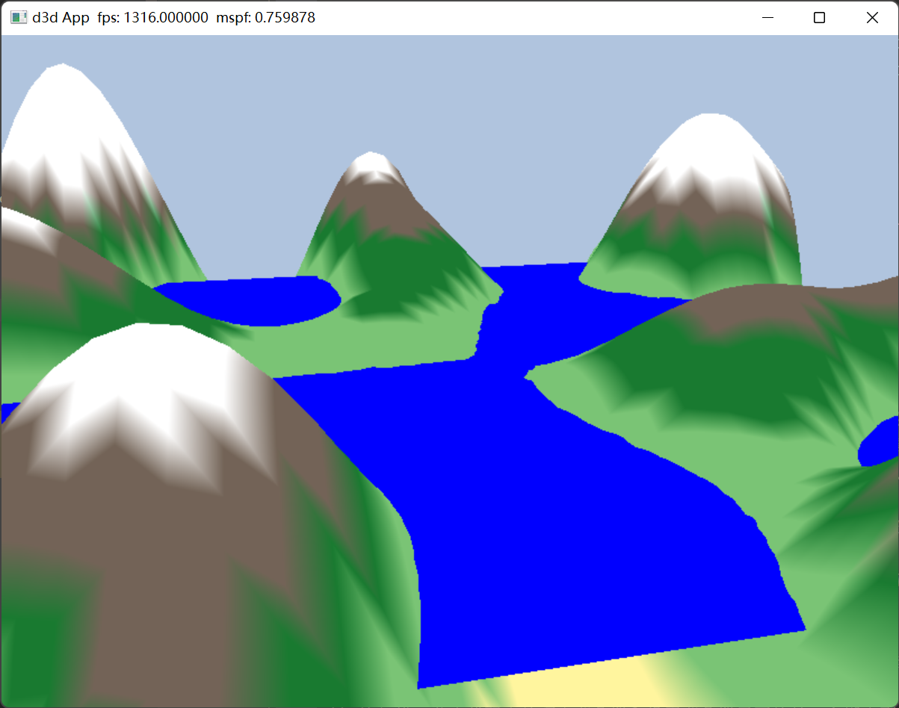

# 利用 Direct3D 绘制几何体（续）

此 “Land and Waves” 演示程序较之前 “Shape” 例程的另一个区别是：我们在前者中使用了根描述
符，因此就可以摆脱描述符堆而直接绑定 CBV 了。为此，程序还要做如下改动：

1. 根签名需要变为取两个根 CBV，而不再是两个描述符表。
2. 不采用 CBV 堆，更无需向其填充描述符。
3. 涉及一种用于绑定根描述符的新语法。 

使用动态缓冲区时会不可避免的产生一些开销，因为必须将新数据从 CPU 端内存回传至 GPU 端显存。这样说来，如果静态缓冲区能实现相同的工作，那么应当比动态缓冲区更受青睐。Direct3D 在最 近的版本中已经引入新的特性，以减少对动态缓冲区的需求。例如：

1. 简单的动画可以在顶点着色器中实现。
2. 可以使用渲染到纹理（render to texture），或者计算着色器（compute shader）与顶点纹理拾取（vertex texture fetch）等技术来实现上述波浪模拟，而且全程皆是在 GPU 中进行的。
3. 几何着色器为 GPU 创建或销毁图元提供了支持，在几何着色器出现之前，一般用 CPU 来处理相关任务。
4. 在曲面细分阶段中可以通过 GPU 来对几何体进行镶嵌化处理，在硬件曲面细分出现之前，通常用 CPU 来处理相关任务。我们也可以用动态缓冲区来创建索引缓冲区。然而，在 “Land and Waves” 演示程序中，由于三角形的拓扑结构保持不变，而仅修改了顶点的高度，因此只需将顶点缓冲区设置为动态缓冲区即可。

本章中的 “Land and Waves” 例程通过一个动态顶点缓冲区实现了本节开端所描述的简易波浪模拟。对于本书来说，我们并没有涉及波浪模拟的具体算法细节，而是把重心更多地放在与动态缓冲区有关的处理流程之上：即用 CPU 来更新波浪的模拟数据，再通过上传缓冲区更新顶点数据。 

再次重申：此演示程序也可以通过如渲染到纹理，或者计算着色器以及顶点纹理拾取等高级技术在 GPU 上加以实现。由于我们现在还未讲到这些主题，所以此波浪模拟程序依然要在 CPU 上运行，并借助动态顶点缓冲区来更新顶点数据。 
