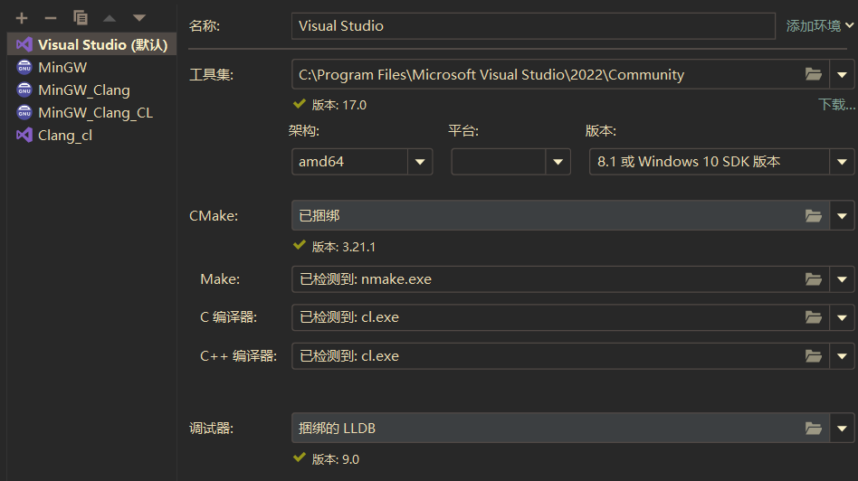
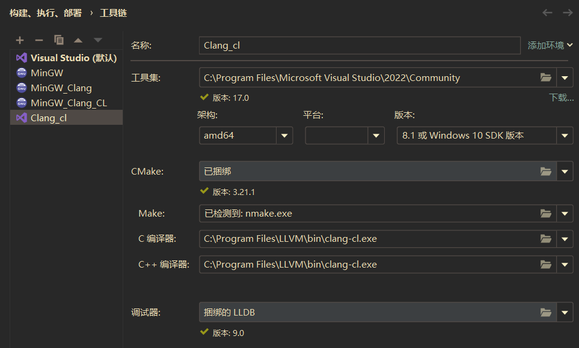
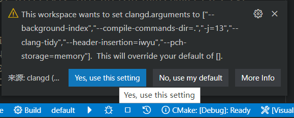
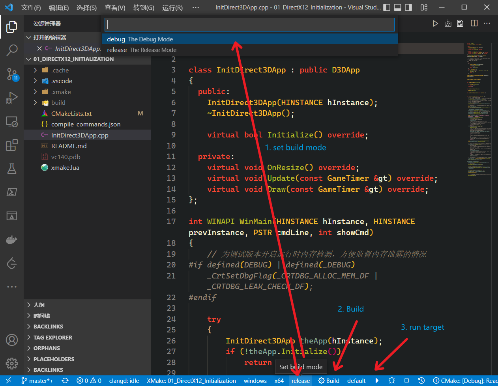

# Build

## Clion

Clion with MSVC、Clang-cl toolchain with CMakeLists.txt.





## Visual Studio

[Visual Studio 中的 CMake 项目](https://docs.microsoft.com/zh-cn/cpp/build/cmake-projects-in-visual-studio?view=msvc-170&viewFallbackFrom=vs-2019)

`cmake -G "Visual Studio 17 2022" -A x64` or other target mentioned in [doc](https://cmake.org/cmake/help/latest/generator/Visual%20Studio%2017%202022.html)

## XMake

install [XMake](https://xmake.io/) and [LLVM Clang](https://github.com/llvm/llvm-project/releases)

```shell
cd .\01_DirectX12_Initialization\
xmake && xmake run  # auto detect compiler 
```

```shell
cd .\LearnDirectX12\
xmake build -w t01 # compile 01_DirectX12_Initialization
xmake r t01 # run 01_DirectX12_Initialization
```

ref: [Windows渲染引擎开发入门教学（4.5）: 更舒适的编译流程](https://zhuanlan.zhihu.com/p/495864590)

## VSCode

vscode 推荐安装 [Clangd](https://marketplace.visualstudio.com/items?itemName=llvm-vs-code-extensions.vscode-clangd) 插件。

```shell
cd .\01_DirectX12_Initialization\
code .
```

## XMake

安装 [XMake](https://marketplace.visualstudio.com/items?itemName=tboox.xmake-vscode) 插件。





### CMake

安装 [CMake Tools](https://marketplace.visualstudio.com/items?itemName=ms-vscode.cmake-tools) 插件。


