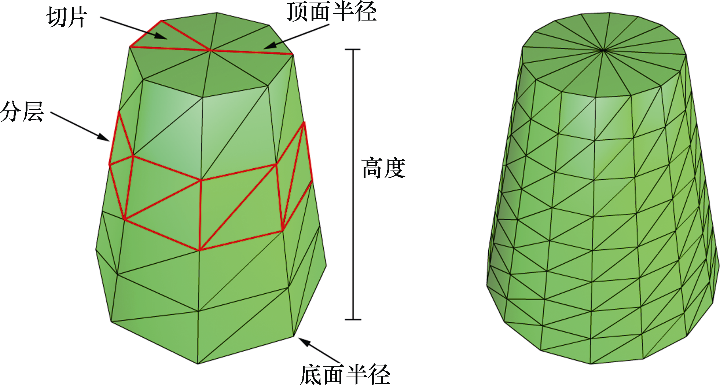
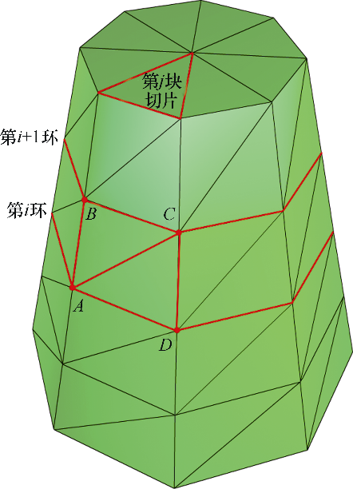
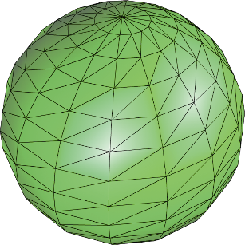
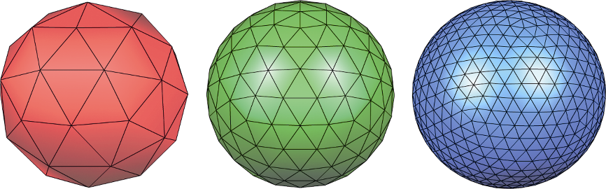
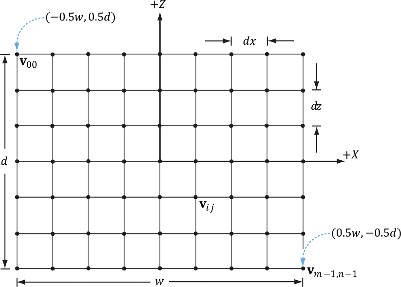
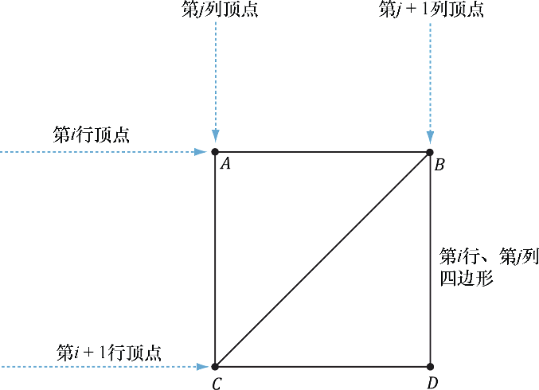

# 生成几何体

也可以参考下 [Catlike Coding > Procedural Meshes](https://catlikecoding.com/unity/tutorials/procedural-meshes/)

我们将程序性几何体（procedural geometry，也有译作过程化几何体。这个词的译法较多，大意就是 “根据用户提供的参数以程序自动生成对应的几何体”）的生成代码放入 GeometryGenerator 类（`GeometryGenerator.h/.cpp`）中。GeometryGenerator 是一个工具类，用于生成如栅格、球体、柱体以及长方体这类简单的几何体，在我们的演示程序中将常常见到它们的身影。此类将数据生成在系统内存中，而我们必须将这些数据复制到顶点缓冲区和索引缓冲区内。GeometryGenerator 类还可创建出一些后续章节要用到的顶点数据，由于我们当前的演示程序中还用不到它们，所以暂时**不会**将这些数据复制到顶点缓冲区。

## 生成柱体网格

在定义一个柱体时，需要指定其顶、底面半径，高度，切片数量（slice count，即将截面分割的块数），以及堆叠层数（stack count，即横向切割的层数），如图 7.1 所示。程序中的柱体呈圆台形状，因而就此展开讨论。我们将圆台的构成分为侧面几何体，顶面几何体以及底面几何体 3 个部分。

图 7.1　左侧圆台被分为 8 个切片，划为 4 层。右侧圆台的被分为 16 个切片，划为 8 层。切片数量和堆叠层数控制着构成圆台的三角形密集程度，三角形越多则所绘图形越接近预定的几何体。注意，圆台顶面半径和底面半径是不同的，所以我们可以借此创建出趋向于锥体的几何体，而不仅仅是 “正” 圆柱体

图 7.2 顶点 A、B、C、D 分别位于第 i 环、第 i + 1 环以及第 j 块切片所合围的侧面块之中 

## 生成球体网格

欲定义一个球体，就要指定其半径、切片数量及其堆叠层数，如图 7.3 所示。除了每个环上的半径是依三角函数非线性变化，生成球体的算法与生成圆台的算法非常相近。我们将把 `GeometryGenerator::CreateSphere` 方法的代码留给读者自行研究。最后，值得一提的是，若采用不等比缩放世界变换，即可将球体转换为椭球体。

图 7.3　柱体的切片与分层思想也同样可以应用到球体上，借此来控制球体的曲面细分级别

## 生成几何球体网格

观察图 7.3 可知，构成球体的三角形面积并不相同，这在某些情景中并非我们所愿。相对而言，几何球体（geosphere）利用面积相同且边长相等的三角形来逼近球体，如图 7.4 所示。

图 7.4　通过反复细分并将新生成的顶点重新投影到球面上，便可以近似地表示一个几何球体

为了生成几何球体，我们以一个正二十面体作为基础，细分其上的三角形，再根据给定的半径向球面投影新生成的顶点。反复重复这个过程，便可以提高该几何球体的曲面细分程度。

## 生成栅格

### 顶点

我们主要的任务就是来构建 xz 平面内的栅格。 m × n 个顶点所构成的栅格具有
(m −1) × (n −1) 个四边形（或称单元格），如图 7.9 所示。每个单元格由两个三角形组成，即有共
2 ⋅ (m −1) × (n −1) 个三角形。如果栅格的宽为 w 且深度为 d，则单元格在 x 轴与 z 轴方向上的间距分别为
dx = w/(n – 1)与 dz = d/(m – 1)。为了生成栅格顶点，我们从左上角开始，逐行渐进地计算顶点坐标。在
xz 平面中，第 i 行、第 j 列栅格顶点的坐标可以表示为：

$$ vij = [−0.5w + j ⋅ dx, 0.0, 0.5d − i ⋅ dz] $$

图 7.9 栅格的结构

### 索引

完成顶点的计算之后，我们需要通过指定索引来定义栅格三角形。为此，我们再次从左上角出发，
逐行遍历每个四边形，并计算索引以定义构成每个四边形的两个三角形。

图 7.10 第 i 行、第 j 列四边形的顶点索引 
